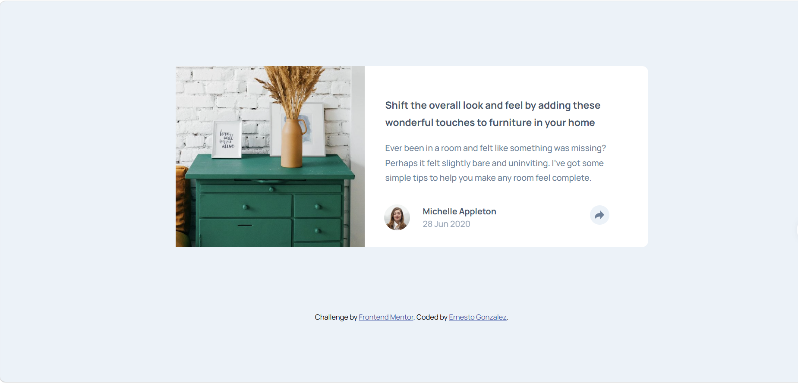

# Frontend Mentor - Article preview component solution

Esta es mi solución al desafío [Article preview component en Frontend Mentor](https://www.frontendmentor.io/challenges/article-preview-component-dYBN_pYFT). Los desafíos de Frontend Mentor ayudan a mejorar las habilidades de desarrollo frontend mediante proyectos del mundo real.

## Tabla de contenidos

- [Visión general](#visión-general)
  - [El desafío](#el-desafío)
  - [Captura de pantalla](#captura-de-pantalla)
  - [Enlaces](#enlaces)
- [Mi proceso](#mi-proceso)
  - [Tecnologías utilizadas](#tecnologías-utilizadas)
  - [Lo que aprendí](#lo-que-aprendí)
  - [Desarrollo continuo](#desarrollo-continuo)
  - [Recursos útiles](#recursos-útiles)
  - [Colaboración con IA](#colaboración-con-ia)
- [Autor](#autor)

## Visión general

### El desafío

Los usuarios deben ser capaces de:

- Ver el diseño óptimo del componente según el tamaño de la pantalla de su dispositivo (Mobile y Desktop).
- Mostrar u ocultar la barra/popup de redes sociales al hacer clic en el botón de compartir (*share*).

### Captura de pantalla

### Enlaces

- Sitio web en vivo: [Ver sitio en vivo](https://yeiyei98.github.io/article-preview-component/)

## Mi proceso

### Tecnologías utilizadas

- Marcado semántico HTML5
- Propiedades personalizadas de CSS (Variables)
- Flexbox
- Posicionamiento CSS (`relative`, `absolute`)
- Flujo de trabajo Mobile-First
- JavaScript puro (Manipulación del DOM y Toggle de clases)

### Lo que aprendí

Durante este proyecto aprendí y me reforcé en los siguientes conceptos clave:

1. **Creación de figuras geométricas con CSS (`::after`)**:
   Comprendí cómo funciona la técnica de bordes en elementos de $0 \times 0$ píxeles para generar un triángulo apuntando hacia abajo que sirve de flecha (*tooltip/bocadillo*) en el popup flotante de redes sociales para la versión desktop.

2. **Uso de Filtros CSS para cambio de color de íconos**:
   Aprendí a transformar el color de un SVG oscuro a blanco puro utilizando `filter: brightness(0) invert(1)` dinámicamente cuando el botón está activo.

3. **Manejo de Layouts Adaptables**:
   Entendí la importancia de agrupar el contenido en contenedores derecho e izquierdo para facilitar la transición de una tarjeta vertical (`flex-direction: column`) en mobile a una horizontal (`flex-direction: row`) en desktop.

### Desarrollo continuo

En mis próximos proyectos me gustaría seguir profundizando en:
- Transiciones CSS fluidas para animar la aparición y desaparición de modales y tooltips (`opacity` y `transform`).
- Accesibilidad en la web (propiedades `aria-expanded` y manipulación del foco para lectores de pantalla en botones interactivos).

### Recursos útiles

- [CSS-Tricks - Shapes of CSS](https://css-tricks.com/the-shapes-of-css/) - Me ayudó a entender conceptualmente cómo se forman las figuras geométricas mediante bordes transparentes.

### Colaboración con IA

- **Herramientas utilizadas**: Gemini y copilot
- **Cómo la utilicé**: La utilicé como un compañero de código para depurar descalces visuales entre layouts (como cambios involuntarios en el alto de la tarjeta), entender a fondo la matemática detrás del centrado absoluto con `left: 50%` y `transform: translateX(-50%)`, y comprender por qué la combinación de bordes de CSS genera un triángulo en pseudoelementos.

## Autor

- Frontend Mentor: [@YeiYei98](https://www.frontendmentor.io/profile/YeiYei98)